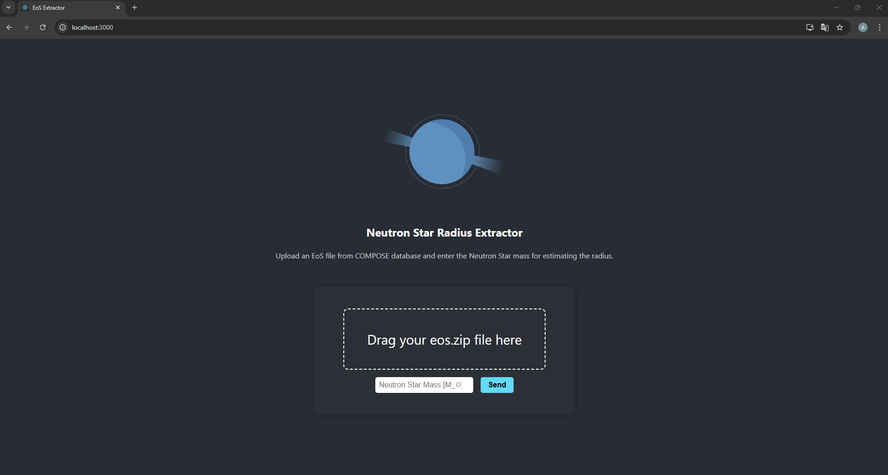

# Neutron Star EoS - Extractor

This web app allows users to extract the **radius of a neutron star** given an `eos.zip` file (from the [Compose database](https://compose.obspm.fr/)) and a target mass. While it currently extracts only the radius, it is intended to be extended to include other quantities from the EoS tables.

This project was created for learning purposes, both to deepen my understanding of EoS tables and to explore how scientific tools can be made accessible through a web application.




Technologies used: **Python** and **FastAPI** (backend), **React** (frontend). Deployment is handled via [Render](https://render.com).

## Live Demo
Try the app here: [https://ns-eos-extractor-frontend.onrender.com](https://ns-eos-extractor-frontend.onrender.com)
> ⚠️ Note: Since the app is hosted on a free Render plan, the backend may take ~30–50s to "wake up" the first time. Be patient! :)

## Video
Here's a short video showing the app in action: https://vimeo.com/1105432258

## Blog Post
I documented the process of transforming a Python script in a web app in this blog post: **[How I turned a simple Python script into a Web App with Render](https://ale-amosso.github.io/2025/07/27/scientific-demo.html)**

## How to Run Locally (on Windows)

  ####  Step 1: Clone the repository

```bash
git clone https://github.com/ale-amosso/ns_eos_extractor.git
cd ns_eos_extractor
```
 #### Step 2: Set up the backend

```bash
cd backend
python -m venv venv
.\venv\Scripts\activate
pip install -r requirements.txt
uvicorn api:app --reload
```
 ####  Step 2: Set up the frontend in a new terminal

```bash
cd ../frontend
npm install
npm start
```

## Project structure
```bash
ns_eos_extractor/
├── backend/   # FastAPI backend and Python logic
└── frontend/  # React frontend
```
